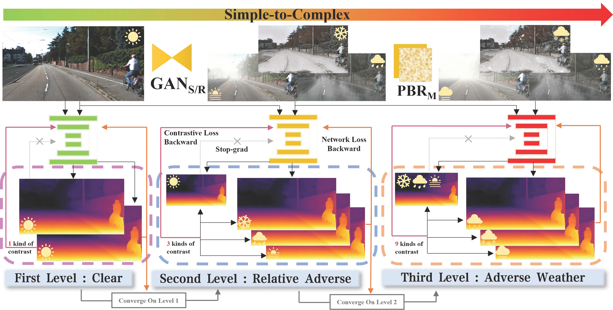

<div align="center">
<h2>WeatherDepth: Curriculum Contrastive Learning for Self-Supervised Depth Estimation under Adverse Weather Conditions</h2>
<a href='https://scholar.google.com/citations?user=subRjlcAAAAJ&hl=zh-CN' target='_blank'>Jiyuan Wang</a><sup>1</sup>•<a href='https://scholar.google.com/citations?hl=zh-CN&user=t8xkhscAAAAJ' target='_blank'>Chunyu lin</a><sup>1</sup>•<a href='https://scholar.google.com/citations?hl=zh-CN&user=vo__egkAAAAJ' target='_blank'>Lang Nie</a><sup>1</sup>•<a href='XXX' target='_blank'>Shujun huang</a><sup>1</sup>

<sup>1</sup>Beijingjiaotong University

**ICRA 2024**

[](https://arxiv.org/abs/2310.05556v2) [](XXX)


<div style="text-align:center">

</div>
</div>

## 📢 Upcoming releases

- [x] release code for testing
- [x] model release (WeatherDepth, WeatherDepth*, Weatherdepth$^\dagger$)
- [x] test data reledase(WeatherKITTI, CADC; DrivingStereo has already available)
- [ ] release code for training (part finished)
- [ ] train/validate data release

## 🛠️Environment Setup

We implement our method on three baselines, and their environments are the same as their baselines. Therefore, you can refer to:

- [**PlaneDepth**(CVPR2023)](https://github.com/svip-lab/PlaneDepth/tree/main)
- [**MonoViT**(3DV2022)](https://github.com/zxcqlf/MonoViT)
- [**WaveletMonoDepth**(CVPR2021)](https://github.com/nianticlabs/wavelet-monodepth)

The inference code was tested on:

- Ubuntu 18.04 LTS, Python 3.8.8, CUDA 11.3, GeForce RTX 3090 (pip, Conda)
- Ubuntu 16.04 LTS, Python 3.7.15, CUDA 10.0, GeForce RTX 2080Ti (pip, Conda)

You should arrange your file tree as:
```bash
├── Evaluate.py
├── README.md
├── ckpt
│   ├── mpvit_small.pth
│   ├── weatherdepthPld
│   │   ├── depth.pth
│   │   └── encoder.pth
│   ├── weatherdepthVit
│   │   ├── depth.pth
│   │   └── encoder.pth
│   └── weatherdepthWav
│       ├── depth.pth
│       └── encoder.pth
...Other files
```

## 🖼️ Dataset Preparation
`The WeatherKITTI dataset is huge (about 500GB), and we are still working on releasing it. `

You can download the WeatherKITTI test dataset from the following links (Excluding sunny scenes, that is the KITTI dataset, corresponding to the RGB part of the file tree):
[**WeatherKITTI** Test](https://pan.baidu.com/s/1pew0QV3Tza-_JdalC8F0jQ?pwd=v4dt),
The data tree should be arranged as:

```bash
kitti
├── fog
│    ├──2011_09_26_drive_0001_sync
│    │    ├── image_02
│    │    │   ├── 150m
│    │    │   └── 75m
│    │    └── image_03
│    │        ├── 150m
│    │        └── 75m
│    ├──...
├── mix_rain
├── mix_snow
├── raingan
├── rgb
     ├──2011_09_26_drive_0001_sync
│    │    ├── image_02
│    │    │   └── data
│    │    ├── image_03
│    │    │   └── data
│    │    ├── oxts
│    │    │   └── data
│    │    └── velodyne_points
│    │        └── data
│    ├──...
├── snowgan
└── splits
```
You can use the CADC and DrivingStereo datasets to evaluate the model's robustness. You can download the datasets from the following links:
- Snowy image at [CADC_devkit](https://github.com/mpitropov/cadc_devkit) and GT depth at [here](https://drive.google.com/file/d/18brjQkqo8tFEYCiG3OlveSGxJ3dn3zOf/view?usp=sharing)
- Rainy/Foggy image and their GT depth at [DrivingStereo](https://drivingstereo-dataset.github.io/)

The data tree should be arranged as:
```bash
├──cadcd
|   ├── 2018_03_06
|   ├── 2018_03_07
|   ├── 2019_02_27
|   └── gt_depths.npy
└──drivingstereo
    ├── foggy
    │   ├── depth-map-full-size
    │   └── left-image-full-size
    └── rainy
        ├── depth-map-full-size
        └── left-image-full-size
```

**Splits**

The train/test/validation splits are defined in the `splits/` folder.
For monocular training (MonoViT baseline), the code will train a depth model using [Zhou's subset](https://github.com/tinghuiz/SfMLearner) of the standard Eigen split of KITTI, which is designed for monocular training.

For stereo-only training (PlaneDepth baseline), we can use the full Eigen training set – see paper for details.

## 💾 Pretrained weights and evaluation

| Models             | abs rel | sq rel | rmse  | rmse log | a1    | a2    | a3    |
|--------------------|---------|--------|-------|----------|-------|-------|-------|
| [WeatherDepth](https://drive.google.com/drive/folders/13evrsuXDnuw6UO7dH0YieYLpC5C2qIJf?usp=sharing)   | 0.099   | 0.673  | 4.324 | 0.185    | 0.884 | 0.959 | 0.981 |
| [WeatherDepth*](https://drive.google.com/drive/folders/1lWwkeYGrZw6cHlUL9RAuENWN5tNDOAnZ?usp=sharing)  | 0.103   | 0.738  | 4.414 | 0.178    | 0.892 | 0.965 | 0.984 |
| [WeatherDepth+ ](https://drive.google.com/drive/folders/1MC8YCbydUNcBFUQ083yNQJfE5niV43X0?usp=sharing) | 0.103|0.777|4.532|0.191|0.878|0.958|0.981|

To evaluate the model on WeatherKITTI, you can run the following command:

```bash
#WeatherDepth*
python Evaluate.py --data_path YOUR_PATH_HERE --eval_mono --net_type vit --width 640 --height 192 --load_weights_folder ./ckpt/weatherdepthVit --eval_split eigen_raw -twt -tww
#WeatherDepth
python Evaluate.py --data_path YOUR_PATH_HERE --eval_stereo --net_type plane --width 1280 --height 384 --load_weights_folder ./ckpt/weatherdepthPld --eval_split eigen_raw -twt -tww 
#WeatherDepth+
python Evaluate.py --data_path YOUR_PATH_HERE --eval_stereo --net_type wav --width 1024 --height 320 --load_weights_folder ./ckpt/weatherdepthWav --eval_split eigen_raw --cuda  -twt -tww
```

To evaluate the model on CADC, you can replace these parts

```bash
--eval_stereo -> --eval_mono ;--eval_split eigen_raw -> --eval_split cadc;(delete) -tww -> None
```

To evaluate the model on DrivingStereo, you can also replace these parts

```bash
--eval_stereo -> --eval_mono;--eval_split eigen_raw -> --eval_split stereo;(delete) -tww -> None
```

For example, to evaluate the model on DrivingStereo with WeatherDepth, you can run the following command:

```bash
python Evaluate.py --data_path YOUR_PATH_HERE --eval_mono --net_type plane --width 1280 --height 384 --load_weights_folder ./ckpt/weatherdepthPld --eval_split cadc -twt
```

If you correctly evaluate the model `(here show WeatherDepth* test WeatherKITTI)`, you will get the following results:

```bash
-> Loading weights from ./ckpt/vitmy
-> Evaluating
   Mono evaluation - using median scaling
-> Computing predictions with size 640x192
           eigen_raw&   abs_rel&    sq_rel&      rmse&  rmse_log&        a1&        a2&        a3\\
100%|███████████████████████████████████████████| 88/88 [00:08<00:00, 10.42it/s]
            rgb/data&     0.099&     0.698&     4.330&     0.174&     0.897&     0.967&     0.984\\
100%|███████████████████████████████████████████| 88/88 [00:07<00:00, 11.22it/s]
        raingan/data&     0.104&     0.761&     4.457&     0.178&     0.892&     0.964&     0.983\\
100%|███████████████████████████████████████████| 88/88 [00:08<00:00, 10.96it/s]
            fog/150m&     0.098&     0.665&     4.256&     0.172&     0.900&     0.968&     0.985\\
100%|███████████████████████████████████████████| 88/88 [00:07<00:00, 11.00it/s]
        snowgan/data&     0.104&     0.749&     4.460&     0.179&     0.890&     0.964&     0.984\\
100%|███████████████████████████████████████████| 88/88 [00:09<00:00,  9.56it/s]
       mix_rain/50mm&     0.107&     0.799&     4.542&     0.182&     0.887&     0.963&     0.983\\
100%|███████████████████████████████████████████| 88/88 [00:07<00:00, 11.05it/s]
       mix_snow/data&     0.111&     0.822&     4.600&     0.186&     0.880&     0.961&     0.982\\
100%|███████████████████████████████████████████| 88/88 [00:07<00:00, 11.20it/s]
             fog/75m&     0.098&     0.675&     4.253&     0.173&     0.901&     0.968&     0.985\\
             average&     0.103&     0.738&     4.414&     0.178&     0.892&     0.965&     0.984\\
```
## ⏳ Training
**Monocular training:**

```shell
python -u train.py --data_path YOUR_PATH_HERE --log_dir YOU_LOG_HERE --model_name WeatherDepthViT --train_strategy cur --num_epochs 30 --weather all --cur_vis 0 --contrast_with 0 0 1 --gan --cta_wadd 0.02 --ss --maxp 0 --net_type vit --do_save
```

**Stereo training:**

```shell
nohup python -u train.py --model_name WeatherDepthPld --data_path YOUR_PATH_HERE --log_dir YOU_LOG_HERE --train_strategy cur --cur_vis 0 --num_epochs 60 --weather all --gan --contrast_with 0 0 1 --cta_wadd 0.01 --ss --maxp 1 --batch_size 6 --do_save
```

## 🎓 Citation
```bibtex
@misc{wang2023weatherdepth,
    title={WeatherDepth: Curriculum Contrastive Learning for Self-Supervised Depth Estimation under Adverse Weather Conditions},
    author={Jiyuan Wang and Chunyu Lin and Lang Nie and Shujun Huang and Yao Zhao and Xing Pan and Rui Ai},
    year={2023},
    eprint={2310.05556},
    archivePrefix={arXiv},
    primaryClass={cs.CV}
}
```

## 📚 Acknowledgements and License
This project is licensed under the MIT License - see the [LICENSE](LICENSE) file for details. The code is based on the PlaneDepth, MonoViT, and WaveletMonoDepth repositories. We thank the authors for their contributions. The data is based on the KITTI, CADC, and DrivingStereo datasets. We thank the authors for their contributions. If you have any questions, please feel free to contact us with issues or email.